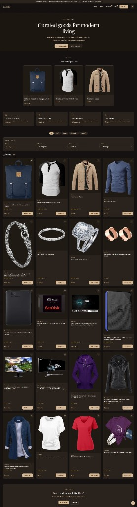
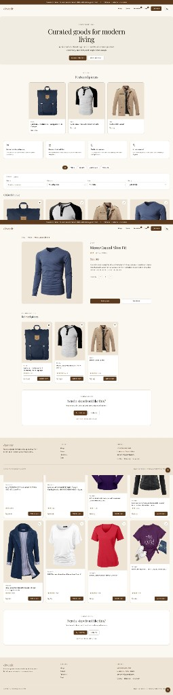
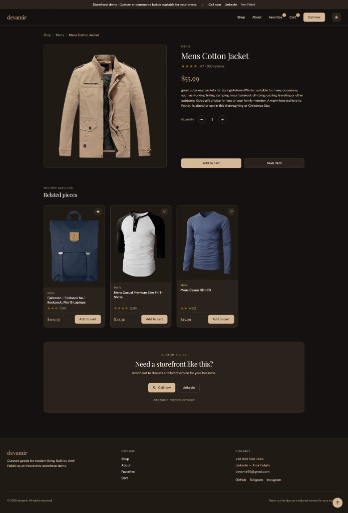
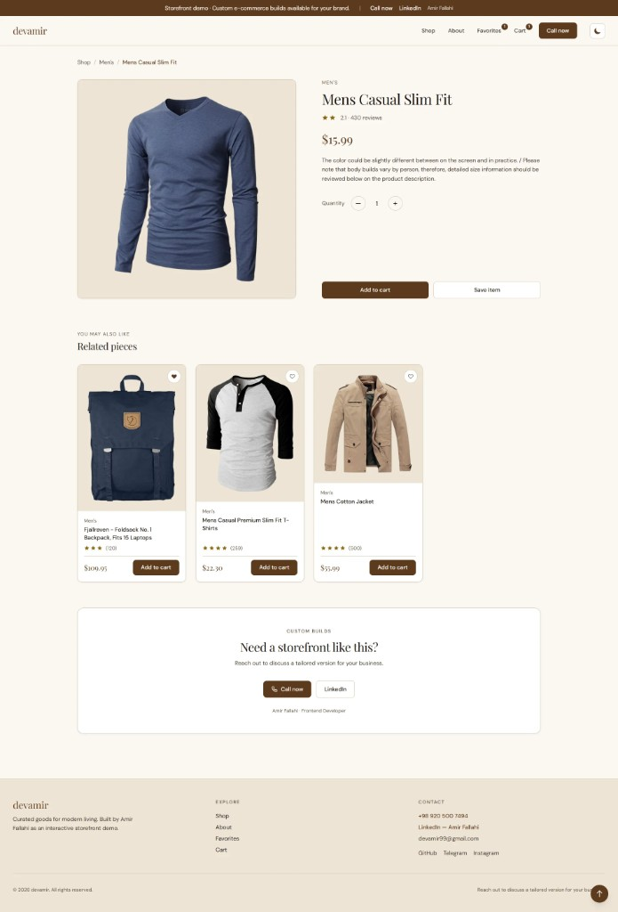

# devamir — Storefront Demo

A minimal, responsive e-commerce storefront built with React and Vite. Designed as a live portfolio demo by **Amir Fallahi** — browse products, save favourites, manage a cart, and walk through a three-step checkout flow.

**Live demo:** deploy with Vercel (see below) and set `VITE_SITE_URL` for social previews.

## Screenshots

### Home — dark & light

<p align="center">
  
</p>

<p align="center">
  <em>Home page · dark theme</em>
</p>

<p align="center">
  
</p>

<p align="center">
  <em>Home page · light theme</em>
</p>

### Product detail — dark & light

<p align="center">
  
</p>

<p align="center">
  <em>Product detail · dark theme</em>
</p>

<p align="center">
  
</p>

<p align="center">
  <em>Product detail · light theme</em>
</p>

## Features

- Product catalogue with search, category, price, and rating filters
- Product detail pages with related items
- Shopping cart with persistent local storage
- Favourites / wishlist
- Three-step checkout (front-end demo — no real payments)
- Dark and light themes
- Cream-and-coffee visual identity
- Mobile-first responsive layout

## Tech stack

- React 19 · Vite 7 · Tailwind CSS 4
- React Router 7
- Local JSON product data (no external API dependency)

## Getting started

```bash
git clone https://github.com/devamir99/fakestore-app.git
cd fakestore-app
npm install
npm run dev
```

Open [http://localhost:5173](http://localhost:5173).

### Environment variables

Copy `env.example` to `.env` and optionally set:

| Variable | Purpose |
|----------|---------|
| `VITE_SITE_URL` | Production URL for Open Graph meta tags |

## Scripts

| Command | Description |
|---------|-------------|
| `npm run dev` | Start development server |
| `npm run build` | Production build |
| `npm run preview` | Preview production build locally |
| `npm run lint` | Run ESLint |

## Deploy to Vercel

1. Push the repo to GitHub
2. Import the project at [vercel.com](https://vercel.com)
3. Set `VITE_SITE_URL` to your deployment URL
4. Deploy — `vercel.json` handles client-side routing

```bash
npm i -g vercel
vercel
```

## Custom builds

This repository is a **demonstration storefront**. For a production-ready shop tailored to your brand, catalogue, and backend:

- **Phone:** [+98 920 500 7494](tel:+989205007494)
- **LinkedIn:** [linkedin.com/in/devamir](https://www.linkedin.com/in/devamir)
- **Email:** devamir99@gmail.com
- **GitHub:** [github.com/devamir99](https://github.com/devamir99)

## License

MIT — see [LICENSE](LICENSE).
